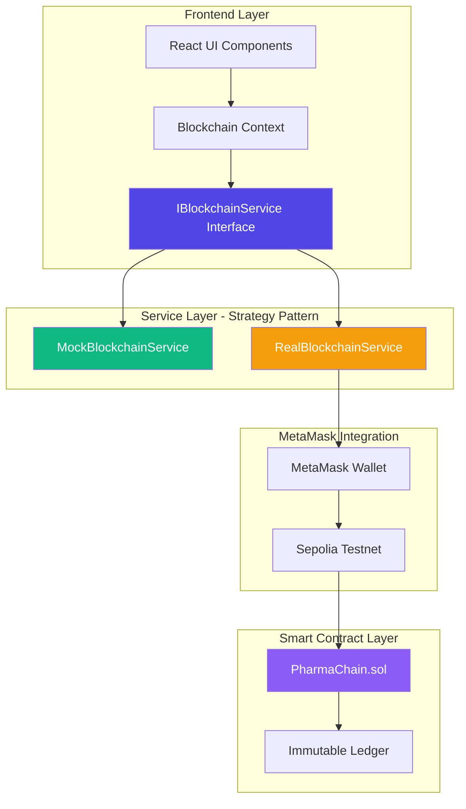

# 🔗 PharmaChain

> **Blockchain-Based Pharmaceutical Supply Chain Tracking System**

[](https://reactjs.org/)
[](https://www.typescriptlang.org/)
[](https://soliditylang.org/)
[](https://hardhat.org/)
[](https://docs.ethers.org/)
[](https://sepolia.etherscan.io/)

**PharmaChain** is an enterprise-grade blockchain solution for tracking pharmaceutical products from manufacturer to patient. It ensures authenticity, quality preservation, and complete supply chain transparency through immutable blockchain records on the **Ethereum Sepolia Testnet**.

---

## 📋 Table of Contents

- [Overview](#overview)
- [Architecture](#architecture)
- [Key Features](#key-features)
- [Tech Stack](#tech-stack)
- [Getting Started](#getting-started)
- [Deployment (Sepolia)](#deployment-sepolia)
- [Demo Scenario](#demo-scenario)
- [Academic Context](#academic-context)
- [Contributors](#contributors)

---

## 🎯 Overview

According to the World Health Organization, **10% of medicines worldwide are counterfeit or substandard**. PharmaChain addresses this critical issue by leveraging blockchain technology to create an **immutable, transparent, and traceable** pharmaceutical supply chain.

### Problem Statement

- **Counterfeit Drugs**: Traditional centralized systems lack transparency.
- **Data Silos**: Multi-party systems prevent end-to-end visibility.
- **Trust Issues**: Low trust between manufacturers, distributors, and pharmacies.
- **Quality Control**: Temperature-sensitive drugs require continuous cold chain monitoring.

### Solution

PharmaChain provides:
- ✅ **Immutable Tracking**: Every product movement is recorded on the blockchain.
- ✅ **Cold Chain Monitoring**: Real-time record of temperature and location updates.
- ✅ **Counterfeit Prevention**: Role-based access ensures only authorized manufacturers can register drugs.
- ✅ **Wallet Integration**: Secure MetaMask login and transaction signing.
- ✅ **QR Code Verification**: Patients can scan products to verify history on-chain.

---

## 🏗️ Architecture

### System Architecture Diagram



### Architecture Highlights

**Dual-Mode Operation:**
- **Mock Mode**: Uses `MockBlockchainService` and `localStorage` for rapid development without gas costs.
- **Live Mode**: Uses `RealBlockchainService` connected to the **Sepolia Testnet** via Ethers.js v6.

**MetaMask Sync:**
- Automatically detects connected wallet addresses.
- Prioritizes MetaMask identity over hardcoded testing addresses.
- Implements transaction signing for every state change (Register, Transfer, Update).

---

## ✨ Key Features

### 🔒 Ethereum-Backed Security
All drug data is stored on-chain. Each drug has a unique ID, and its ownership history is stored as a linked list of events (`DrugRegistered`, `DrugTransferred`).

### 🌡️ Cold Chain Monitoring (IoT Simulation)
Simulates IoT sensor data by recording temperature and location updates directly to the blockchain from the distributor or pharmacy.

### 👥 Role-Based Access Control
- **Manufacturer**: Authorizes registration of new products.
- **Distributor**: Handles bulk transfers and cold-chain compliance.
- **Pharmacy**: Verifies history and finalizes sale to patient.
- **Patient**: End-to-end transparency without needing a wallet (View-only).

### � Real-Time Block Explorer
An integrated explorer showing transaction hashes, methods, and block status directly from the Sepolia network.

---

## 🚀 Getting Started

### Prerequisites
- **Node.js** 18+
- **MetaMask** Browser Extension
- **Sepolia Test ETH** (Get it from [Alchemy Faucet](https://sepoliafaucet.com/))

### Installation
1. **Clone & Install**
   ```bash
   git clone https://github.com/xPoleStarx/pharmachain.git
   cd pharmachain
   npm install
   ```
2. **Setup Environment**
   Create a `.env` file based on [.env.example](.env.example):
   ```env
   VITE_USE_REAL_BLOCKCHAIN=true
   VITE_CONTRACT_ADDRESS=0x3FFBcF2b1B9fbEF76908B139064Fe830532B2E93
   VITE_PROVIDER_URL=https://eth-sepolia.g.alchemy.com/v2/YOUR_KEY
   ```
3. **Run Development Server**
   ```bash
   npm run dev
   ```

---

## � Deployment (Sepolia)

The project is already optimized for Sepolia. If you wish to deploy your own version:

1. **Compile**: `npx hardhat compile`
2. **Deploy**: `npx hardhat run scripts/deploy.cjs --network sepolia`
3. **Verify**: Check [Sepolia Etherscan](https://sepolia.etherscan.io/) for your contract.

For detailed instructions, refer to the [Sepolia Deployment Guide](SEPOLIA_DEPLOYMENT_GUIDE.md).

---

## 🎬 Demo Scenario

To test the full supply chain flow (Manufacturer → Distributor → Pharmacy → Patient), please follow the **[Live Demo Scenario](DEMO_SENARYOSU.md)**. 

---

## 🎓 Academic Context

This project was developed as part of **CENG 3550: Decentralized Systems and Applications** course at **Muğla Sıtkı Koçman University**.

### Course Information
- **Institution**: Muğla Sıtkı Koçman University, Department of Computer Engineering
- **Timeline**: November 2025 - January 2026
- **Instructors**: Dept. of Computer Engineering Faculty

---

## 👥 Contributors

**Seyfullah Korkmaz**
- System architecture design, Frontend development (React/TypeScript), Ethers.js integration

---

<div align="center">

**Built with ❤️ for Pharmaceutical Supply Chain Transparency**

[Report Bug](https://github.com/xPoleStarx/pharmachain/issues) · [Request Feature](https://github.com/xPoleStarx/pharmachain/issues)

</div>
