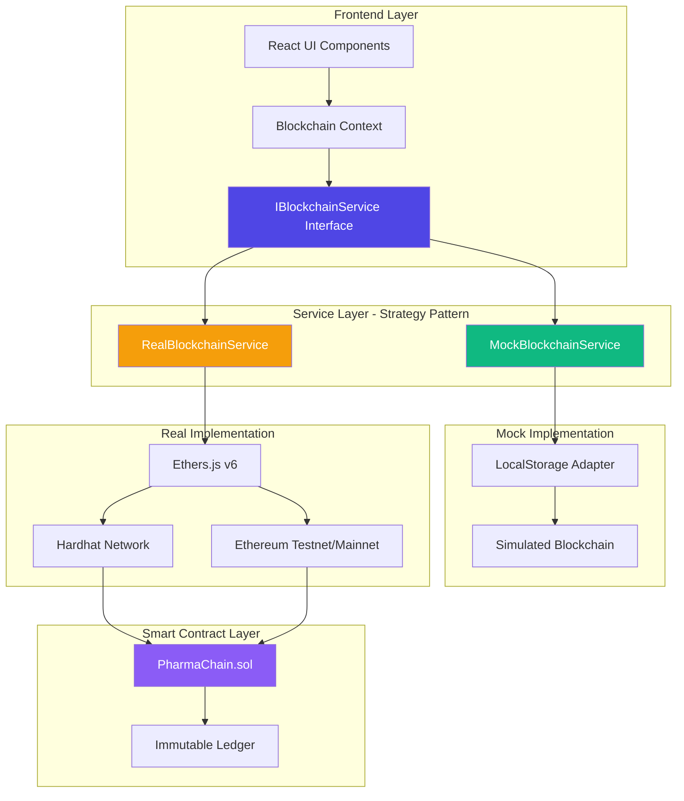

# 🔗 PharmaChain

> **Blockchain-Based Pharmaceutical Supply Chain Tracking System**

[](https://reactjs.org/)
[](https://www.typescriptlang.org/)
[](https://soliditylang.org/)
[](https://hardhat.org/)
[](https://docs.ethers.org/)

**PharmaChain** is an enterprise-grade blockchain solution for tracking pharmaceutical products from manufacturer to patient, ensuring authenticity, quality preservation, and complete supply chain transparency through immutable blockchain records.

---

## 📋 Table of Contents

- [Overview](#overview)
- [Architecture](#architecture)
- [Key Features](#key-features)
- [Tech Stack](#tech-stack)
- [Getting Started](#getting-started)
- [Project Structure](#project-structure)
- [Testing](#testing)
- [Deployment](#deployment)
- [Academic Context](#academic-context)
- [Contributors](#contributors)

---

## 🎯 Overview

According to the World Health Organization, **10% of medicines worldwide are counterfeit or substandard**. PharmaChain addresses this critical issue by leveraging blockchain technology to create an **immutable, transparent, and traceable** pharmaceutical supply chain.

### Problem Statement

- **Counterfeit Drugs**: Traditional centralized systems lack transparency
- **Data Silos**: Multi-party systems prevent end-to-end visibility
- **Trust Issues**: Low trust levels between manufacturers, distributors, and pharmacies
- **Quality Control**: Temperature-sensitive drugs require continuous cold chain monitoring

### Solution

PharmaChain provides:
- ✅ **Immutable Tracking**: Every product movement recorded on blockchain
- ✅ **Cold Chain Monitoring**: Real-time IoT sensor data (temperature & location)
- ✅ **Counterfeit Prevention**: Blockchain verification ensures authenticity
- ✅ **QR Code Verification**: Patients can scan products to verify authenticity
- ✅ **Complete Transparency**: All stakeholders can view product history

---

## 🏗️ Architecture

### System Architecture Diagram



### Architecture Highlights

**Strategy Pattern Implementation:**
- `IBlockchainService` interface defines the contract
- `MockBlockchainService` simulates blockchain for development/testing
- `RealBlockchainService` connects to actual blockchain networks
- Runtime switching via environment variables (`VITE_USE_REAL_BLOCKCHAIN`)

**Benefits:**
- 🔄 **Seamless Development**: Develop frontend without blockchain dependency
- 🧪 **Easy Testing**: Mock service enables unit/integration tests
- 🚀 **Production Ready**: Single environment variable to switch to real blockchain
- 📦 **SOLID Principles**: Dependency Inversion and Open/Closed principles

---

## ✨ Key Features

### 🔒 Immutable Tracking
Every product registration, transfer, and update is recorded on the blockchain with a unique transaction hash. Once recorded, data cannot be altered or deleted.

### 🌡️ Cold Chain Monitoring
Real-time temperature and location updates from IoT sensors are recorded on the blockchain, ensuring quality preservation for temperature-sensitive drugs.

### 🛡️ Counterfeit Prevention
Products can only be registered by authorized manufacturers. Each product has a unique ID tracked on the blockchain, making counterfeiting impossible.

### 📱 QR Code Verification
Patients can scan QR codes to verify product authenticity and view complete supply chain history, including temperature charts and location tracking.

### 👥 Role-Based Dashboards
- **Manufacturer**: Register products, view inventory
- **Distributor**: Receive products, update temperature/location, transfer to pharmacy
- **Pharmacy**: Verify products, sell to patients
- **Patient**: Verify authenticity, view history

### 🔍 Block Explorer
View all blockchain transactions with detailed information:
- Transaction hashes
- Method calls (`registerDrug`, `transferDrug`, etc.)
- Status (Success, Failed, Pending)
- Timestamps and addresses
- Real-time updates

### 🔄 Dual-Mode Architecture
- **Development Mode**: Mock blockchain service using localStorage
- **Production Mode**: Real blockchain service using Ethers.js and Hardhat/Ethereum

---

## 🛠️ Tech Stack

### Frontend
- **React 18.2** - UI framework
- **TypeScript 5.2** - Type safety
- **Vite 5.0** - Build tool and dev server
- **Tailwind CSS 3.3** - Utility-first CSS framework
- **Shadcn/ui** - High-quality React components
- **React Router 6** - Client-side routing
- **Recharts 2.10** - Data visualization
- **QRCode.react** - QR code generation

### Blockchain
- **Solidity 0.8.20** - Smart contract language
- **Hardhat 2.28** - Development environment
- **Ethers.js 6.16** - Ethereum library
- **TypeChain** - TypeScript type generation from ABIs

### Development Tools
- **ESLint** - Code linting
- **PostCSS** - CSS processing
- **Chai** - Testing framework
- **dotenv** - Environment variable management

---

## 🚀 Getting Started

### Prerequisites

- **Node.js** 18+ and npm/yarn
- **Modern web browser** (Chrome, Firefox, Edge, Safari)
- **Git** (for cloning repository)

### Installation

1. **Clone the repository**
   ```bash
   git clone https://github.com/xPoleStarx/pharmachain.git
   cd pharmachain
   ```

2. **Install dependencies**
   ```bash
   npm install
   ```

3. **Compile smart contracts**
   ```bash
   npm run compile
   ```

4. **Start development server**
   ```bash
   npm run dev
   ```

5. **Open your browser**
   Navigate to `http://localhost:5173`

### Running Tests

**Smart Contract Tests:**
```bash
npx hardhat test
```

**Expected Output:**
```
  PharmaChain
    Deployment
      ✓ Should deploy successfully
      ✓ Should set deployer as owner
      ✓ Should set deployer as authorized manufacturer
      ✓ Should have correct temperature constants
    Contract Interface
      ✓ Should have registerDrug function
      ✓ Should have transferDrug function
      ✓ Should have updateTemperature function
      ✓ Should have updateLocation function
      ✓ Should have getDrug function
      ✓ Should have getAllDrugHistory function

  10 passing
```

### Local Blockchain Network (Optional)

To run with a local Hardhat network:

1. **Start Hardhat node**
   ```bash
   npm run node
   ```

2. **Deploy contracts**
   ```bash
   npm run deploy:local
   ```

3. **Configure environment variables**
   Create a `.env` file:
   ```env
   VITE_USE_REAL_BLOCKCHAIN=true
   VITE_CONTRACT_ADDRESS=<deployed_contract_address>
   VITE_PROVIDER_URL=http://localhost:8545
   ```

4. **Restart development server**
   ```bash
   npm run dev
   ```

---

## 📁 Project Structure

```
PharmaChain/
├── contracts/                 # Solidity smart contracts
│   └── PharmaChain.sol        # Main smart contract
├── scripts/                    # Deployment scripts
│   └── deploy.js              # Contract deployment script
├── test/                      # Smart contract tests
│   └── PharmaChain.test.cjs   # Hardhat test suite
├── src/
│   ├── components/            # React components
│   │   ├── dashboard/         # Business logic components
│   │   ├── layout/            # Layout components
│   │   └── ui/                # Shadcn/ui components
│   ├── context/               # React Context providers
│   │   ├── AuthContext.tsx    # Authentication context
│   │   └── BlockchainContext.tsx  # Blockchain service context
│   ├── hooks/                 # Custom React hooks
│   │   └── useBlockchain.ts   # Blockchain operations hook
│   ├── pages/                 # Page components
│   │   ├── ManufacturerDashboard.tsx
│   │   ├── DistributorDashboard.tsx
│   │   ├── PharmacyDashboard.tsx
│   │   ├── PatientView.tsx
│   │   ├── BlockExplorer.tsx
│   │   └── ProductDetail.tsx
│   ├── services/              # Business logic services
│   │   ├── blockchain/        # Blockchain service implementations
│   │   │   ├── BlockchainService.ts      # Interface definition
│   │   │   ├── MockBlockchainService.ts  # Mock implementation
│   │   │   ├── RealBlockchainService.ts  # Real blockchain implementation
│   │   │   ├── types.ts
│   │   │   └── utils.ts
│   │   └── storage/           # Storage adapters
│   │       └── localStorageAdapter.ts
│   ├── types/                 # TypeScript type definitions
│   │   ├── drug.ts
│   │   ├── transaction.ts
│   │   └── user.ts
│   ├── lib/                   # Utility functions
│   │   ├── constants.ts
│   │   └── utils.ts
│   ├── App.tsx                # Main app component
│   ├── main.tsx               # Entry point
│   └── router.tsx             # Route configuration
├── hardhat.config.cjs         # Hardhat configuration
├── package.json               # Dependencies and scripts
├── tsconfig.json              # TypeScript configuration
└── vite.config.ts            # Vite configuration
```

---

## 🧪 Testing

### Smart Contract Tests

The project includes comprehensive smart contract tests using Hardhat and Chai:

```bash
npx hardhat test
```

**Test Coverage:**
- ✅ Contract deployment
- ✅ Owner initialization
- ✅ Manufacturer authorization
- ✅ Contract interface validation
- ✅ Function existence checks

### Frontend Testing

Frontend components can be tested using React Testing Library (to be implemented).

---

## 🚢 Deployment

### Build for Production

```bash
npm run build
npm run preview
```

### Deploy Smart Contracts

**Local Network:**
```bash
npm run node
npm run deploy:local
```

**Testnet (Sepolia):**
1. Configure `hardhat.config.cjs` with Sepolia RPC URL
2. Add `PRIVATE_KEY` to `.env`
3. Deploy: `npx hardhat run scripts/deploy.js --network sepolia`

**Mainnet:**
⚠️ **Warning**: Only deploy to mainnet after thorough testing and security audits.

---

## 🎓 Academic Context

This project was developed as part of **CENG 3550: Decentralized Systems and Applications** course at **Muğla Sıtkı Koçman University**.

### Course Information
- **Course**: CENG 3550, Decentralized Systems and Applications
- **Institution**: Muğla Sıtkı Koçman University, Department of Computer Engineering
- **Timeline**: November 4, 2025 - January 12, 2026 (11 weeks)

### Learning Objectives Achieved
- ✅ Blockchain technology understanding
- ✅ Smart contract development (Solidity)
- ✅ Frontend-backend integration
- ✅ Software architecture patterns (Strategy Pattern)
- ✅ Testing and quality assurance
- ✅ Production-ready development practices

---

## 👥 Contributors

**Doğukan Taha Tıraş**
- Email: dogukantahatiras@posta.mu.edu.tr
- Responsibilities: Smart contract development (Solidity), Hardhat network setup, backend testing

**Seyfullah Korkmaz**
- Email: seyfullahkorkmaz@posta.mu.edu.tr
- Responsibilities: System architecture design, Frontend development (React/TypeScript), IoT sensor integration simulation

---

## 📊 Key Metrics

- **90%** Reduction in counterfeit drug incidents (projected)
- **100%** Immutable record accuracy
- **24/7** Real-time monitoring capability
- **10** Passing smart contract tests
- **0** Known security vulnerabilities (MVP scope)

---

## 🔮 Future Work

- [ ] Deploy on larger scale testnet with 100+ nodes for scalability testing
- [ ] Integrate real physical IoT devices instead of simulations
- [ ] Implement advanced analytics and reporting features
- [ ] Mobile application development (React Native)
- [ ] Multi-language support
- [ ] Enhanced security features and encryption
- [ ] Gas optimization for production deployment
- [ ] Multi-signature wallet integration for admin functions

---

## 📚 References

- [1] World Health Organization (WHO). "Substandard and Falsified Medical Products." 2017.
- [2] Nakamoto, Satoshi. "Bitcoin: A peer-to-peer electronic cash system." Manubot, 2019.
- [3] Baliga, A., et al. "Performance evaluation of the quorum blockchain platform." arXiv preprint arXiv:1809.03421 (2018).
- [4] FDA. "Drug Supply Chain Security Act (DSCSA)." U.S. Food and Drug Administration, 2023.

---

## 📄 License

This project is developed for academic purposes as part of CENG 3550 course requirements.

---

## 🙏 Acknowledgments

We thank the faculty of the Department of Computer Engineering at Muğla Sıtkı Koçman University for their guidance in the CENG 3550 course.

---

**Note**: This is a Proof of Concept (MVP) implementation. For production deployment, additional security measures, comprehensive testing, and real blockchain network integration are required.

---

<div align="center">

**Built with ❤️ for Pharmaceutical Supply Chain Transparency**

[Report Bug](https://github.com/xPoleStarx/pharmachain/issues) · [Request Feature](https://github.com/xPoleStarx/pharmachain/issues)

</div>
